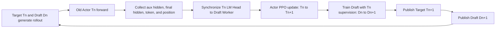
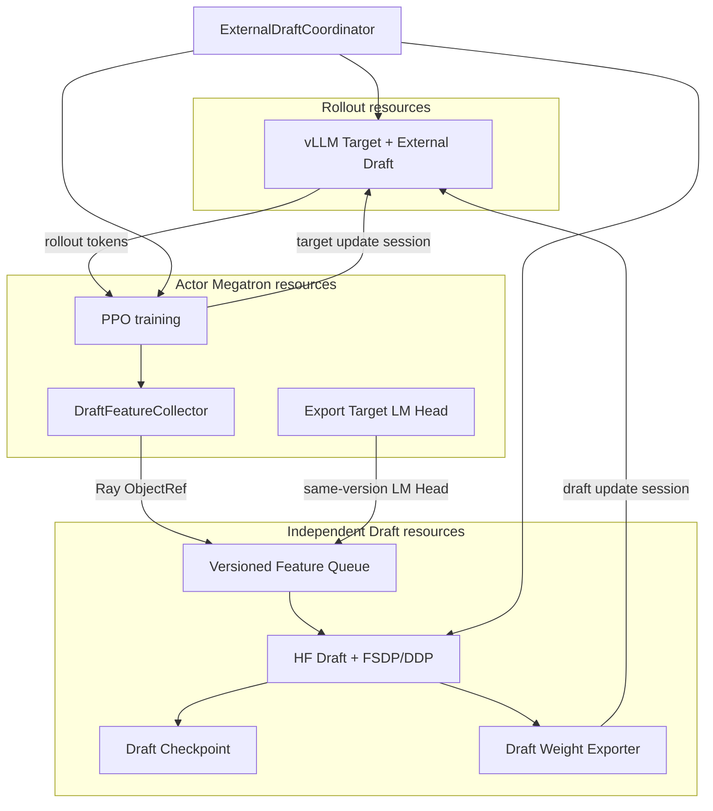

# VIME External Draft Training Design

## 1. Background

VIME can already load an external EAGLE Draft model through vLLM's
`SpeculativeConfig` for speculative decoding. However, online training currently
only covers the MTP layers inside the Target model. As Target parameters change
throughout RL training, an external Draft model gradually becomes misaligned.
This lowers Draft-token acceptance and average acceptance length, and may
eventually make the additional Draft and verification cost larger than the
speculative-decoding benefit.

This design follows the implementation ideas in verl-SpeCo. It turns hidden
states of the Target model on RL data into Draft training samples, trains an
independent Draft model during every Actor update or at a fixed interval, and
hot-updates the new weights into the external Draft model used by vLLM.

VIME already provides the following building blocks:

- vLLM external EAGLE Draft inference configuration;
- old-policy/current-policy log-prob forward in the Megatron Actor;
- Ray training Actors and placement groups;
- online Target-weight synchronization to vLLM;
- the `start_draft_weight_update` Draft-weight update entry point;
- rollout pause, cache flush, weight update, and generation-resume flow;
- speculative acceptance-rate and acceptance-length fields in Samples.

The core capabilities to add are:

1. Collect Draft-training features from the Megatron Target forward pass;
2. Provide an independent external Draft model, optimizer, and checkpoint;
3. Coordinate Target and Draft weight publication;
4. Manage Target/Draft/Feature version consistency;
5. Expose complete Draft-training and speculative-decoding metrics.

## 2. Design Goals

### 2.1 Functional goals

- Train an external EAGLE3 Draft model online during VIME RL training;
- Collect auxiliary-layer hidden states and final hidden states from the Actor's
  old-policy forward pass;
- Ensure that hidden states, the frozen Target LM Head, and the supervision
  distribution come from the same Target version;
- Periodically hot-update new Draft weights to every vLLM rollout engine;
- Save and restore the Draft model, optimizer, scheduler, and version state;
- Provide collect-only feature persistence for offline Draft training and
  diagnosis;
- Preserve the exact Target distribution during speculative decoding and avoid
  changing the PPO sample objective distribution.

### 2.2 Performance goals

- Collect only selected samples and token windows instead of storing full-batch,
  full-sequence hidden states;
- Transfer large feature tensors through Ray ObjectRefs or an equivalent
  point-to-point channel rather than through the Python driver;
- Make Draft-training impact on rollout time configurable and observable;
- In production, update both Target and Draft weights within one rollout pause
  window;
- Achieve higher end-to-end rollout tokens/s after online training than the
  no-speculation baseline.

### 2.3 Non-goals

The first phase does not include:

- designing a new speculative-decoding algorithm from scratch;
- rewriting the external Draft model as a Megatron model;
- lossy speculative acceptance;
- cross-stage feature aggregation under PP/CP;
- complex co-location of Actor, rollout, and Draft resources;
- DFlash, DSpark, Domino, or P-EAGLE;
- fully asynchronous multi-version Draft training.

## 3. Reference Implementation Analysis

verl-SpeCo forms the complete loop through three layers of extensions:

- `SpecoTaskRunner` replaces the upstream PPO Trainer and injects Draft-weight
  publication into the rollout worker;
- `SpecoRayPPOTrainer` hooks rollout, old-logprob, Actor updates, and rollout
  weight publication;
- an independent `SpecoWorker` receives CPU/Ray ObjectRef features and trains
  and publishes the Draft periodically.

Reference files:

- [TaskRunner integration](../../../../verl-SpeCo/verl_speco/integration/task_runner.py)
- [PPO Trainer integration](../../../../verl-SpeCo/verl_speco/trainer/speco_ray_trainer.py)
- [Draft Worker](../../../../verl-SpeCo/verl_speco/workers/speco_worker.py)
- [Draft Trainer](../../../../verl-SpeCo/verl_speco/trainer/base_trainer.py)
- [Feature data format](../../../../verl-SpeCo/verl_speco/trainer/feature_store.py)

### 3.1 Reference timeline



This timeline has two properties:

1. The aux hidden, final hidden, and LM Head inside one Draft-training sample
   all belong strictly to the same `Tn` version;
2. The next serving pair is `Target Tn+1 + Draft Dn+1`, so Draft has one bounded
   round of lag behind the new Target.

The first phase keeps this behavior. Compared with running an additional
`Tn+1` feature forward after the Actor update, it significantly reduces
training cost. The impact of the lag is monitored explicitly through version
fields and acceptance metrics.

### 3.2 Supported reference algorithms

| Algorithm | Supervision | Treatment in this design |
|---|---|---|
| EAGLE3 | Multi-layer aux hidden; final hidden passed through a frozen LM Head to generate soft labels | First-phase implementation |
| EAGLE1/2 | Hidden SmoothL1 regression and token soft-CE | Future |
| DFlash | Multi-anchor parallel block training | Candidate for phase two |
| DSpark | DFlash, Markov bias, and L1 distribution matching | Future |
| Domino | DFlash with a GRU causal correction head | Future |
| P-EAGLE | COD downsampled parallel prediction with KL training | Future |

### 3.3 Why the reference orchestration is not copied directly

verl-SpeCo's Target/rollout is based on the verl worker system, and its Draft
Trainer uses Hugging Face Transformers and FSDP. VIME uses a Megatron Actor,
packed sequences, and TP, PP, CP, and VPP layouts. Therefore:

- Draft model, loss, data-alignment rules, and feature schema can be ported;
- verl workers, dispatch, configuration, and process-group code should not be
  copied directly;
- Target hidden collection must be implemented specifically for the Megatron
  pipeline and packed sequences;
- Target-to-vLLM conversion should continue using VIME's existing
  Megatron-to-HF path;
- Draft-to-vLLM publication should use an independent HF Draft parameter
  iterator.

## 4. VIME Current State and Extension Points

### 4.1 Main training loop

The current [train.py](../../../train.py) timeline is:

```text
rollout_manager.generate
    -> actor_model.async_train
    -> actor_model.save_model
    -> actor_model.update_weights
```

The suitable extension is:

```text
rollout_manager.generate
    -> actor_model.async_train and collect Draft features
    -> draft_model.collect/train
    -> save Actor/Draft
    -> jointly publish Target/Draft
```

### 4.2 Actor forward pass

[MegatronTrainRayActor](../../../vime/backends/megatron_utils/actor.py) already
calls `forward_only` through `compute_log_prob`. This is the first-phase feature
collection entry point because:

- it runs before Actor parameters are updated;
- the current Actor weights normally match the rollout Target weights for this
  round;
- the input already contains the complete prompt/response tokens required by
  PPO training;
- there is no need to extend the vLLM generation response protocol to return
  large hidden-state payloads.

The existing `custom_megatron_before_log_prob_hook` can only run before the
forward pass. It cannot access per-layer outputs, batch token positions, or the
final hidden state. A structured collector must therefore be added inside
`forward_only` instead of relying only on the existing hook.

### 4.3 vLLM Draft weight update

[VLLMEngine](../../../vime/backends/vllm_utils/vllm_engine.py) exposes:

- `start_weight_update`;
- `start_draft_weight_update`;
- `finish_weight_update`.

During a Draft update session, VIME's vLLM patch switches the weight-transfer
target to the Draft model inside the external `DraftModelSpeculator`. The
existing MTP update already follows this timeline:

```text
pause generation
flush cache
start target update
send target weights
finish target update
start draft update
send draft weights
finish draft update
continue generation
```

External Draft training should reuse this lifecycle, but the Draft weights must
come from the independent Draft Worker rather than sending Actor weights again
as in the MTP path.

## 5. Overall Architecture



### 5.1 Resource topology

Add a `draft` role:

```python
pgs = {
    "actor": ...,
    "critic": ...,
    "rollout": ...,
    "draft": ...,
}
```

The first phase recommends a dedicated GPU for Draft:

- do not join the Actor's Megatron TP/PP/DP process groups;
- initialize an independent FSDP/DDP process group inside Draft Worker;
- deliver different samples to each Draft DP rank;
- let only the global Draft leader generate the publication snapshot;
- optionally offload the model and optimizer to CPU after training, controlled
  by configuration.

An independent resource group increases GPU consumption, but significantly
reduces these first-phase risks:

- conflicts between Megatron and FSDP process groups;
- memory competition among Actor optimizer, Draft optimizer, and rollout engine;
- NCCL deadlocks caused by co-located sleep/wake ordering;
- Draft training contaminating Actor-step performance measurements.

## 6. Module Design

### 6.1 `ExternalDraftCoordinator`

Responsibilities:

- decide whether the current rollout should collect, train, save, and publish;
- forward feature manifests returned by Actor to the Draft resource group;
- synchronize the corresponding Target LM Head before Actor update;
- drive Draft training and collect metrics;
- coordinate Target/Draft rollout hot updates;
- maintain rollout id, Target version, Draft version, and the published version;
- skip a Draft update on recoverable errors instead of breaking the PPO main
  flow.

Recommended interface:

```python
class ExternalDraftCoordinator:
    def should_collect(self, rollout_id: int) -> bool: ...
    def should_train(self, rollout_id: int) -> bool: ...
    def collect(self, rollout_id: int, manifests: list[FeatureManifest]) -> dict: ...
    def sync_target_head(self, rollout_id: int, head_ref: ObjectRef) -> dict: ...
    def train(self, rollout_id: int) -> DraftTrainResult: ...
    def save(self, rollout_id: int, force_sync: bool = False) -> None: ...
    def update_rollout_weights(self, actor_model, rollout_manager) -> dict: ...
```

### 6.2 `DraftFeatureCollector`

The collector runs during the Actor `forward_only` lifecycle:

1. Generate a collection plan from rollout id, sample rate, and token budget;
2. Install forward hooks on configured Transformer layers;
3. Install a forward-pre-hook on the LM Head/output layer to capture the hidden
   state after final norm;
4. Run the existing log-prob forward pass;
5. Restore packed microbatches to the original sample order;
6. Slice token, hidden, and position tensors according to the collection window;
7. Asynchronously copy them to CPU BF16 pinned memory;
8. Create Ray ObjectRefs and return only a lightweight manifest upstream;
9. Remove every hook in `finally` to prevent duplicate registration and leaks.

The collection plan must be deterministic. The recommended hash is:

```text
seed = hash(global_seed, rollout_id, original_sample_id)
```

This lets every rank independently derive the same window without relying on
Python process random state.

### 6.3 Final-hidden capture point

EAGLE3 with `use_logits=false` requires final hidden to exactly match the input
to the Target LM Head. Capture it at:

```text
Transformer layers
    -> final norm
    -> [capture here]
    -> LM Head
```

Do not substitute the raw output of the last Transformer layer, especially for
pre-norm models. Otherwise the distribution rebuilt by the frozen LM Head will
not match Actor logits.

Run this consistency check at initialization and periodically:

```text
argmax(TargetLMHead(captured_final_hidden))
    == argmax(Actor logits)
```

Also record the maximum logit error or top-k agreement. Reject the feature batch
when the configured threshold is exceeded.

### 6.4 Draft training Actor

Add an independent `ExternalDraftRayActor` instead of placing the logic inside
`MegatronTrainRayActor`:

```python
class ExternalDraftRayActor:
    def init_model(self): ...
    def collect_features(self, manifests): ...
    def sync_target_lm_head(self, payload, target_version): ...
    def train_draft(self, rollout_id, target_version): ...
    def save_model(self, rollout_id, force_sync=False): ...
    def prepare_publish_snapshot(self, draft_version): ...
    def send_weights_to_rollout(self, update_session): ...
```

The Draft implementation can reuse or port the following from verl-SpeCo:

- EAGLE3 model structure;
- vocabulary mapping;
- Target embedding loading;
- future-step probability-distillation loss;
- token-mean gradient normalization;
- Draft checkpoint metadata.

The following parts must be replaced:

- OmegaConf/verl configuration access;
- verl dispatch and worker groups;
- verl rollout TP/SP mesh;
- Actor LM Head export interface;
- SGLang hidden-state layout;
- verl checkpoint-manager hooks.

### 6.5 Draft weight publisher

The Draft publisher must emit HF parameter names and tensor layouts compatible
with the vLLM Draft checkpoint.

Responsibilities:

- export a publish state from FSDP full/sharded state;
- filter optimizer state, frozen Target LM Head, and non-serving parameters;
- convert to the configured BF16/FP16 publication dtype;
- send parameters in buckets to bound a single Ray/NCCL payload;
- compute parameter-name, shape, dtype, and checksum metadata;
- call `start_draft_weight_update` and send Draft parameters;
- commit the new Draft version only after every engine succeeds.

If any rollout engine update fails:

- do not mark the current Draft version as published;
- keep generation paused until Target/Draft state is consistent or explicitly
  rolled back;
- fail fast in the first phase instead of silently using a partially updated
  engine cluster.

## 7. Data Contract

### 7.1 `DraftFeatureSample`

Use an explicit schema version:

```python
@dataclass
class DraftFeatureSample:
    schema_version: int
    algorithm: str

    input_ids: torch.Tensor
    loss_mask: torch.Tensor
    position_ids: torch.Tensor
    hidden_positions: torch.Tensor

    aux_hidden_states: torch.Tensor
    final_hidden_states: torch.Tensor | None
    target_topk_logprobs: torch.Tensor | None

    rollout_id: int
    target_weight_version: str
    original_sample_id: str
    prompt_length: int
    response_length: int
    window_start: int
    window_end: int
    aux_layer_ids: list[int]
    hidden_layout: str
```

First-phase constraints:

- `algorithm == "EAGLE3"`;
- `final_hidden_states` must be present;
- `target_topk_logprobs` must be empty;
- the last dimension of `aux_hidden_states` is layer-concatenated `[L * H]`;
- tensors must be contiguous after the CPU transfer;
- hidden states use BF16, token/position use int64, and loss masks use float32
  or bool;
- `window_end - window_start` must exactly match the number of hidden rows.

### 7.2 EAGLE3 alignment

Let `h_aux[p]` be the auxiliary hidden state at position `p`, and
`h_final[p]` the final hidden state at position `p` entering the LM Head. The
first-phase training alignment is:

```text
Draft feature:      h_aux[p]
Draft token input:  x[p+1]
Target distribution: LMHead_Tn(h_final[p+1])
Target token mask:  loss_mask[p+2]
```

An effective training window therefore needs to retain enough subsequent
token/final-hidden rows beyond the Draft feature rows. Window construction and
truncation must understand the shifts before slicing any tensor.

### 7.3 Loss mask

- Prompt tokens do not contribute to Draft token loss;
- padding, invalid, and truncated placeholder tokens in the response do not
  contribute to loss;
- only positions with a complete future target contribute to loss;
- window truncation must not count the last prompt token as a response token;
- multi-turn agent data must reuse VIME's existing `loss_masks` instead of
  rebuilding them only from prompt length.

### 7.4 Version contract

Every feature must carry:

```text
target_weight_version
rollout_id
lm_head_version
feature_schema_version
draft_architecture_fingerprint
```

First-phase training rule:

```text
sample.target_weight_version == current_target_head_version
```

Otherwise reject the sample and record
`draft/feature_rejected_version_mismatch`.

If a cross-step buffer is enabled later, store the corresponding LM Head
snapshot for every Target version, or switch to a supervision mode that stores
Target top-k logits. Never process old-version final hidden with the current
LM Head.

## 8. Megatron Parallel Processing

### 8.1 DP

- Each Actor DP rank collects only local samples;
- preserve the original global sample id in the manifest;
- assign samples to Draft DP ranks using a deterministic hash or round-robin;
- assign each sample to exactly one Draft DP owner to avoid duplicate training;
- reduce loss and token count across the Draft DP group.

### 8.2 TP

The collector must understand `sequence_parallel`:

- when hidden is replicated across TP ranks, export only from TP rank 0;
- when hidden is sequence-sharded, all-gather across TP first and then rebuild
  packed sequences using `cu_seqlens`;
- when hidden is sharded on the hidden dimension, gather along the correct
  dimension;
- do not create an ObjectRef before gather completes;
- add shape and position-continuity assertions to prevent silent concatenation
  errors.

### 8.3 PP/VPP

The first phase requires `PP=1` and `VPP=1`.

When PP is supported later:

- locate the PP/VPP stage from the global layer id;
- capture only local target layers on each stage;
- aggregate multiple layers of one sample through a dedicated communication
  group or Ray refs;
- export final hidden from the last pipeline stage;
- admit a sample to the Draft queue only after all target layers are present.

### 8.4 CP

The first phase requires `CP=1`.

Future CP support must restore the original token order after CP splits the
sequence into prefix/suffix or blocks, while also restoring position, loss mask,
aux hidden, and final hidden. Gathering hidden without rebuilding mask and
position creates difficult-to-detect supervision misalignment.

## 9. Online Training Timeline

### 9.1 Initialization

1. Parse and validate the Draft configuration;
2. Create the rollout manager;
3. Create Actor/Critic;
4. Create the Draft resource group;
5. Load the Draft model, optimizer, scheduler, and checkpoint;
6. Validate the Draft checkpoint against the vLLM speculative config;
7. Publish initial Target weights;
8. Publish or validate initial Draft weights when necessary;
9. Compare Target/Draft checksums in the rollout engines;
10. Start rollout.

### 9.2 Per-round training

| Stage | Target version | Draft version | Behavior |
|---|---:|---:|---|
| rollout | `Tn` | `Dn` | vLLM generates samples |
| feature capture | `Tn` | `Dn` | Old Actor forward collects `Tn` features |
| head sync | `Tn` | `Dn` | Synchronize the `Tn` LM Head |
| Actor train | `Tn -> Tn+1` | `Dn` | PPO update |
| Draft train | `Tn+1` | `Dn -> Dn+1` | Train with `Tn` supervision |
| publish | `Tn+1` | `Dn+1` | Update vLLM Target/Draft in order |

### 9.3 Collection and training intervals

Collection and training are controlled independently:

```text
collect_interval_rollouts
train_interval_rollouts
publish_interval_rollouts
```

Constraints:

- never trigger a Draft optimizer step without valid collected samples;
- never publish an empty snapshot when Draft training did not succeed;
- if Draft training succeeds before the publication interval, keep the latest
  state at the training side;
- the next publication must publish the latest complete Draft state, not a chain
  of parameter deltas;
- checkpoint and publication intervals may differ.

## 10. Weight Update Design

### 10.1 First-phase implementation

To reduce the change scope, the first phase permits:

```text
actor_model.update_weights()
draft_model.update_weights()
```

This may cause two generation pauses and is intended only to validate
correctness and end-to-end benefit.

### 10.2 Production implementation

Split the existing Target updater lifecycle into:

```python
session = rollout_manager.begin_weight_update(
    pause_generation=True,
    flush_cache=True,
)

actor_model.send_target_weights(session)
draft_model.send_draft_weights(session)

rollout_manager.commit_weight_update(session)
```

Internally this still uses two vLLM update sessions:

1. `start_weight_update` / `finish_weight_update`;
2. `start_draft_weight_update` / `finish_weight_update`.

Generation, however, is paused and resumed only once.

### 10.3 Atomicity

One joint publication contains:

```text
target_version = N+1
draft_version = M+1
pair_id = hash(target_version, draft_version)
```

Commit the pair only after every engine succeeds. If any engine fails, the
router must not continue dispatching new requests to a partially updated
engine.

The first phase uses fail-fast. Later phases may add:

- retries from the CPU publication snapshot;
- temporarily removing the failed engine from the router;
- restoring the previous Target/Draft pair;
- resynchronizing by version after an engine restart.

## 11. Configuration Design

Recommended arguments:

| Argument | Default | Description |
|---|---:|---|
| `--enable-external-draft-training` | false | Enable external Draft online training |
| `--draft-algorithm` | eagle3 | Draft algorithm |
| `--draft-model-path` | null | Draft HF checkpoint |
| `--draft-model-factory-path` | null | EAGLE3 model factory when Transformers `auto_map` is unavailable |
| `--draft-target-embedding-path` | `--hf-checkpoint` | Target checkpoint for initializing Draft embeddings |
| `--draft-target-embedding-key` | `model.embed_tokens.weight` | Target embedding parameter name |
| `--draft-num-nodes` | 1 | Number of Draft nodes |
| `--draft-num-gpus-per-node` | 1 | Draft GPUs per node |
| `--draft-feature-layer-ids` | null | Target auxiliary layer ids |
| `--draft-collect-interval` | 1 | Feature collection interval |
| `--draft-collection-sample-rate` | 1.0 | Sample collection rate |
| `--draft-max-samples-per-rollout-per-dp` | 16 | Sample budget per Actor DP |
| `--draft-max-tokens-per-rollout-per-dp` | 16384 | Token budget per Actor DP |
| `--draft-hidden-window-mode` | front | `front` or `random` |
| `--draft-hidden-window-tokens` | 512 | Per-sample window length |
| `--draft-train-interval` | 1 | Draft training interval |
| `--draft-train-steps-per-trigger` | 10 | Optimizer steps per trigger |
| `--draft-batch-size-per-gpu` | 4 | Draft batch size |
| `--draft-learning-rate` | 1e-5 | Draft learning rate |
| `--draft-lr-scheduler-type` | constant | `constant` or `cosine` |
| `--draft-lr-warmup-steps` | 0 | Draft scheduler warmup steps |
| `--draft-lr-total-steps` | 0 | Total cosine steps; 0 derives it from the rollout plan |
| `--draft-publish-interval` | 1 | Draft publication interval |
| `--draft-publish-dtype` | bf16 | Publication dtype |
| `--draft-checkpoint-path` | null | Draft checkpoint directory |
| `--draft-save-interval` | null | Draft save interval |
| `--draft-collect-only` | false | Collect features without online training |
| `--draft-feature-store-path` | null | Feature-store path |
| `--draft-offload-model` | false | Offload Draft model while idle |
| `--draft-offload-optimizer` | false | Offload optimizer while idle |

Minimum phase-one example (other Actor/rollout arguments come from the existing
training script):

```bash
--enable-external-draft-training \
--draft-model-path /models/eagle3 \
--draft-model-factory-path your_package.eagle3.build_model \
--draft-num-nodes 1 \
--draft-num-gpus-per-node 1 \
--draft-feature-layer-ids 2,16,29 \
--draft-checkpoint-path /checkpoints/draft \
--draft-train-steps-per-trigger 10 \
--draft-batch-size-per-gpu 4 \
--update-weight-mode full \
--update-weight-transport nccl \
--vllm-speculative-config '{"method":"eagle3","model":"/models/eagle3","num_speculative_tokens":3}'
```

If the Draft checkpoint provides a trainable Transformers `auto_map`, omit
`--draft-model-factory-path`. Target embeddings are loaded by default from
`model.embed_tokens.weight` in `--hf-checkpoint`; override
`--draft-target-embedding-key` for models with different parameter names.

Startup validation:

- `vllm_speculative_config.method == "eagle"`;
- the speculative config `model` identifies the same architecture as
  `draft-model-path`;
- Draft `target_hidden_size` matches the Actor hidden size;
- the number of auxiliary layers required by Draft matches
  `draft-feature-layer-ids`;
- Draft vocabulary mapping covers every Draft vocabulary row;
- the first-phase `PP=1` and `CP=1` constraints hold;
- no lossy acceptance method is enabled;
- the Draft architecture fingerprint in the checkpoint matches the current
  configuration.
