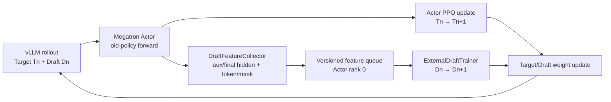

# RFC：VIME 外部 EAGLE3 Draft 在线训练

| 项目 | 内容 |
|---|---|
| 状态 | Proposed（已有原型与 Ascend smoke 验证） |
| 目标版本 | 待维护者确认 |
| 作者 | VIME contributors |
| 讨论范围 | 外部 Draft 在线训练、特征采集、版本管理与热更新 |
| 首期算法 | EAGLE3，`use_logits=false` |
| 首期后端 | Megatron Actor + vLLM rollout |

## 摘要

本文提议为 VIME 增加外部投机解码 Draft 模型的在线训练闭环。首期支持
EAGLE3：在 Actor 的旧策略 log-prob 前向中采集 Target 模型的多层 hidden state、
final-norm hidden、token、position 和 loss mask；在 Actor 全局 rank 0 上串行训练
独立 Draft 模型；随后将 Target 与 Draft 的新权重发布到 vLLM rollout engine。

该方案不新增专用 Draft 卡。Draft Trainer 与 Actor rank 0 共卡，但 Actor 反向与
Draft 反向严格串行，Draft 不加入 Megatron 的 TP/DDP collective。特征、Target
LM Head、Draft checkpoint 和发布快照均携带版本信息，避免使用错误版本的 Target
监督训练 Draft。

本 RFC 的目标是先合入一个行为明确、可观测、可恢复的 MVP，再逐步扩展 PP/CP、
独立 Draft 资源组、异步训练和更多 Draft 算法。

## 1. 背景与动机

VIME 已能通过 vLLM 的 speculative config 加载外部 EAGLE Draft 模型进行推理，
但 RL 训练只持续更新 Target。固定 Draft 会逐渐偏离新的 Target 分布，导致：

- Draft token 接受率下降；
- 平均接受长度下降；
- Draft 前向和 Target 验证的额外开销可能超过投机解码收益；
- 训练后期的 rollout 吞吐不稳定。

verl-SpeCo 证明了从 Target 前向采集 hidden state、持续训练 Draft 并在线发布权重的
闭环是可行的。但 VIME 使用 Megatron Actor、packed sequence、Ray placement group
以及既有的 Megatron-to-vLLM 权重同步链路，不能直接复用 verl worker 和 FSDP 编排。

本提案复用 verl-SpeCo 的 EAGLE3 数据对齐和训练思想，同时保持 VIME 当前 Actor、
rollout 和权重更新架构。

## 2. 目标

### 2.1 功能目标

- 在 VIME RL 主循环中在线训练外部 EAGLE3 Draft 模型；
- 从 Megatron Actor 前向采集 EAGLE3 所需的多层 hidden state；
- 保证 feature、final hidden 和 Target LM Head 来自同一 Target 版本；
- 按可配置周期采集、训练、保存和发布 Draft；
- 将 Draft 新权重热更新到所有 vLLM rollout workers；
- 保存 Draft model、optimizer、scheduler、版本和架构指纹；
- 输出 Draft loss、accuracy、grad norm、版本和 speculative acceptance 指标；
- 不改变 Target 采样分布，继续使用 lossless speculative acceptance。

### 2.2 性能与资源目标

- MVP 不新增专用 Draft accelerator bundle；
- 通过样本数、token 数和 hidden window 限制特征内存；
- 大体积 feature 使用 Ray ObjectRef，不经过 driver 序列化；
- Actor 和 Draft 反向串行，避免同一设备上的并发反向和 collective 冲突；
- Target 与 Draft 尽量在同一次 rollout pause 中完成发布。

### 2.3 非目标

首期不包含：

- EAGLE1/2、DFlash、DSpark、Domino、P-EAGLE 等算法；
- `PP > 1`、`VPP > 1` 或 `CP > 1` 下的跨 stage 特征重建；
- Draft 多卡训练或独立 Draft placement group；
- Actor 与 Draft 并发反向；
- 多 Target 版本异步 feature queue；
- 有损 speculative acceptance；
- 与 Megatron MTP 同时训练；
- 端到端吞吐提升的最终性能承诺。

## 3. 术语

- `Tn`：第 n 轮 rollout 使用的 Target 权重版本；
- `Dn`：第 n 轮 rollout 使用的 Draft 权重版本；
- feature：从 Target 前向采集的 hidden、token、position 和 mask；
- publish snapshot：供 vLLM 热更新使用的 CPU Draft 参数快照；
- acceptance length：一次 Target 验证中平均接受的 token 数；
- acceptance rate：Draft token 中被 Target 接受的比例。

## 4. 提议方案

### 4.1 总体架构



### 4.2 资源布局

MVP 使用 4 张 Actor 卡和 4 张 rollout 卡作为验证配置，但设计不固定卡数。

```text
Actor placement group
  rank 0: Target TP shard + ExternalDraftTrainer
  rank 1..N: Target TP shard

Rollout placement group
  vLLM Target + external EAGLE3 Draft
```

关键决策：

1. 不创建 Draft placement group；
2. `ExternalDraftTrainer` 仅在 Actor 全局 rank 0 初始化；
3. Actor 当前训练阶段结束后，driver 才触发 Draft optimizer step；
4. Draft 使用 `distributed=False`，不加入 Actor 的 TP/DDP process group；
5. Draft checkpoint 和 publish snapshot 仅由 rank 0 生成。

该选择减少一张专用 Draft 卡，适合小型 EAGLE3 Draft。代价是 rank 0 需要额外容纳
Draft 参数、梯度和 optimizer state，其余 Actor ranks 在 Draft step 期间等待。

### 4.3 每轮时序

| 阶段 | Target | Draft | 行为 |
|---|---:|---:|---|
| rollout | `Tn` | `Dn` | vLLM 生成 RL 样本 |
| old-policy forward | `Tn` | `Dn` | 计算 log-prob 并采集 Draft feature |
| LM Head export | `Tn` | `Dn` | rank 0 导出同版本 Target LM Head |
| Actor train | `Tn → Tn+1` | `Dn` | PPO/GRPO 更新 |
| Draft train | `Tn+1` | `Dn → Dn+1` | 使用采集自 `Tn` 的 feature 和 LM Head |
| checkpoint | `Tn+1` | `Dn+1` | 按周期保存 Draft 状态 |
| publish | `Tn+1` | `Dn+1` | 向 vLLM 发布 Target 与 Draft |

一条 Draft 样本内部必须满足：

```text
feature.target_weight_version == target_lm_head.version
```

Draft 相对最新 Target 最多存在一轮有界滞后。该行为通过版本指标显式监控。

### 4.4 特征采集

`DraftFeatureCollector` 在 Actor `compute_log_prob` 的前向生命周期内工作：

1. 根据 rollout id、sample rate 和 token budget 生成采集计划；
2. 在指定 Transformer layer 注册 forward hook；
3. 在 LM Head 输入处注册 pre-forward hook，获取 final-norm hidden；
4. 运行原有 old-policy log-prob 前向；
5. 根据 packed sequence 元数据恢复每个原始样本；
6. 截取配置的 hidden window；
7. 收集 token ids、position ids、loss mask、aux hidden 和 final hidden；
8. 转移到 CPU 并通过 Ray ObjectRef 返回；
9. 在 `finally` 中卸载 hook，避免重复注册和引用泄漏。

final hidden 必须是 Target LM Head 的真实输入，不能用最后一层 Transformer 的原始
输出代替。否则对于 pre-norm 模型，重建的监督 logits 与 Actor logits 不一致。

### 4.5 Feature schema

每条 `DraftFeatureSample` 至少包含：

```text
schema_version
rollout_id
target_weight_version
sample_id
token_ids
position_ids
loss_mask
aux_hidden[layer_id]
final_hidden
```

入队前执行以下检查：

- 所有 tensor 的 token 维长度一致；
- `position_ids` 连续且与截取窗口一致；
- 所需 aux layer 全部存在；
- hidden size 与 Draft config 一致；
- feature 版本与当前 Target LM Head 版本一致；
- 有效 loss token 数大于零。

### 4.6 EAGLE3 训练后端

首期后端实现 EAGLE3 `use_logits=false`：

- 使用配置的三层 Target aux hidden；
- 使用 final hidden 经冻结 Target LM Head 得到 soft target；
- 按 EAGLE3 的 `p / p+1 / p+2` 时序构造输入和监督；
- 只在有效 response token 上计算损失；
- 输出 loss、top-1/top-5 accuracy、valid tokens 和 grad norm；
- 对 Draft gradient 执行可配置裁剪。

Draft 模型优先通过 Transformers `auto_map` 加载。checkpoint 不提供可训练模型类时，
使用：

```text
--draft-model-factory-path package.module.factory
```

factory 接收 `(args, device)` 并返回 `torch.nn.Module`。如训练模型参数名与 vLLM Draft
参数名不同，模型可实现 `export_for_vllm(dtype, device)` 完成显式转换。

### 4.7 控制面

`ExternalDraftTrainGroup` 保留 driver 侧控制接口，实际计算委托给 Actor rank 0：

```python
class ExternalDraftTrainGroup:
    def create(self): ...
    def collect_actor_results(self, actor_results): ...
    def train_draft(self, rollout_id): ...
    def prepare_publish_snapshot(self): ...
    def mark_published(self, draft_version): ...
    def save_draft(self, rollout_id, force_sync=False): ...
    def release(self): ...
```

driver 不接收 feature tensor，只处理 ObjectRef、版本和轻量 metrics。

### 4.8 权重发布

Draft 训练成功后，rank 0 创建 CPU publish snapshot。`train.py` 将 snapshot 暂存到
Actor weight updater，随后调用现有 `actor_model.update_weights()`：

```text
pause rollout generation
flush KV/prefix cache
start Target update
publish Target weights
finish Target update
start external Draft update
publish Draft weights
finish Draft update
resume rollout generation
```

只有所有 rollout engine 都确认更新成功，Draft version 才标记为 published。部分 engine
失败时必须 fail-fast，不能继续使用混合版本提供 rollout。

### 4.9 Checkpoint 与恢复

Draft checkpoint 保存：

- model state；
- optimizer state；
- scheduler state；
- Draft version；
- 最近 rollout id；
- Target weight version；
- architecture fingerprint；
- feature schema version。

恢复时检查 checkpoint 的下一 rollout 是否与 Actor checkpoint 对齐。版本回退、架构指纹
不一致或 shape/name mapping 失败均应终止启动，避免静默使用错误 Draft。

## 5. 配置接口

最小启用配置：

```bash
--enable-external-draft-training \
--draft-algorithm eagle3 \
--draft-model-path /models/qwen3-eagle3 \
--draft-model-factory-path vime.backends.speculative_training.factories.verl_speco_eagle3.build_model \
--draft-feature-layer-ids 2,18,33 \
--draft-checkpoint-path /checkpoints/draft \
--update-weight-mode full \
--update-weight-transport nccl \
--vllm-speculative-config '{"method":"eagle3","model":"/models/qwen3-eagle3","num_speculative_tokens":3}'
```

主要参数：

| 参数 | 默认值 | 说明 |
|---|---:|---|
| `--enable-external-draft-training` | false | 启用外部 Draft 在线训练 |
| `--draft-algorithm` | eagle3 | Draft 算法，MVP 仅支持 EAGLE3 |
| `--draft-model-path` | null | 初始 Draft checkpoint |
| `--draft-model-factory-path` | null | 自定义训练模型 factory |
| `--draft-target-embedding-path` | HF checkpoint | Target embedding 来源 |
| `--draft-target-embedding-key` | `model.embed_tokens.weight` | embedding 参数名 |
| `--draft-feature-layer-ids` | 自动推导 | Target aux layer ids |
| `--draft-collect-interval` | 1 | feature 采集周期 |
| `--draft-collection-sample-rate` | 1.0 | 样本采集比例 |
| `--draft-max-samples-per-rollout-per-dp` | 16 | 单 DP 每轮样本预算 |
| `--draft-max-tokens-per-rollout-per-dp` | 16384 | 单 DP 每轮 token 预算 |
| `--draft-hidden-window-mode` | front | `front` 或 `random` |
| `--draft-hidden-window-tokens` | 512 | 单样本窗口长度 |
| `--draft-train-interval` | 1 | Draft 训练周期 |
| `--draft-train-steps-per-trigger` | 10 | 每次触发 optimizer steps |
| `--draft-batch-size-per-gpu` | 4 | Draft micro batch size |
| `--draft-learning-rate` | 1e-5 | Draft 学习率 |
| `--draft-max-grad-norm` | 1.0 | Draft gradient clipping |
| `--draft-publish-interval` | 1 | Draft 发布周期 |
| `--draft-publish-dtype` | bf16 | 发布参数 dtype |
| `--draft-checkpoint-path` | null | Draft checkpoint 目录 |
| `--draft-save-interval` | Actor save interval | Draft 保存周期 |
| `--draft-queue-max-samples` | 2048 | 有界 feature queue 大小 |

## 6. 启动约束与兼容性

启用外部 Draft 训练时，MVP 强制要求：

- `train_backend=megatron`；
- rollout 与训练资源分离，拒绝 `--colocate`；
- `PP=1`、`VPP=1`、`CP=1`；
- `update_weight_mode=full`；
- `update_weight_transport=nccl`；
- vLLM speculative method 为 `eagle` 或 `eagle3`；
- vLLM Draft model 与 `--draft-model-path` 指向同一 checkpoint；
- 使用 lossless acceptance；
- 不启用 MTP training、routing replay、`keep_old_actor` 或 `release_train`。

功能默认关闭，因此不改变现有 VIME 训练行为和参数兼容性。

## 7. 异常处理

### 7.1 跳过当前 Draft step

以下情况记录指标并跳过 Draft optimizer，不中断 Actor 主流程：

- 当前周期未采集到 feature；
- 样本没有有效 response token；
- 单个样本缺少目标 layer；
- 样本对齐检查失败；
- 尚未达到 collect/train/publish interval。

### 7.2 必须 fail-fast

- feature 与 Target LM Head 版本不一致；
- 各 Actor rank 返回的 Target version 分叉；
- Draft checkpoint 与 Actor checkpoint rollout 不对齐；
- Draft architecture fingerprint 不一致；
- 参数名或 shape 不能完整映射到 vLLM Draft；
- Target/Draft 发布只在部分 rollout engine 成功；
- Draft version 回退；
- 不受支持的并行拓扑或 acceptance method。

## 8. 可观测性

### 8.1 Draft 数据与训练

```text
draft/collect_accepted
draft/collect_received
draft/collect_queued
draft/collect_rejected_version_mismatch
draft/train_loss
draft/train_top1_accuracy
draft/train_top5_accuracy
draft/train_valid_tokens
draft/train_grad_norm
draft/train_optimizer_steps
draft/train_learning_rate
draft/train_draft_version
draft/train_target_weight_version
draft/publish_published
draft/publish_draft_version
```

### 8.2 投机解码

```text
rollout/spec_accept_rate
rollout/spec_accept_length
accepted tokens
drafted tokens
per-position acceptance rate
rollout throughput
```

Draft loss 下降是必要但不充分条件。最终验收必须同时观察 acceptance length、acceptance
rate 和端到端 rollout tokens/s。

## 9. Smoke 测试策略

仓库提供：

```text
scripts/run-qwen3-4B-eagle3-train-npu-smoke.sh
scripts/run-qwen3-4B-eagle3-train-npu-smoke-host.sh
scripts/data/qwen3_eagle3_smoke_math.jsonl
```

宿主机包装脚本用于共享测试服务器，会在启动前：

1. 停止测试容器内残留 Ray 和 vLLM EngineCore；
2. 清理物理 NPU 0–7 的占卡进程；
3. 等待并复检进程没有重生；
4. 再进入容器启动 smoke。

该清理脚本属于测试基础设施，不应作为生产调度方案。

### 9.1 Smoke reward fallback

短数学 smoke 样本容易出现同一 GRPO group 全对或全错，组内标准差为零。GRPO 中心化后
advantage 全零，从而使 Actor `grad_norm=0`。测试脚本可通过：

```text
vime.backends.speculative_training.smoke_rewards.ensure_nonzero_grpo_signal
```

仅对零方差 group 构造交替的 0/1 reward，以验证 Actor 反向、Draft 训练和权重发布链路。
它通过 `--custom-reward-post-process-path` 显式启用，不修改生产 reward 逻辑。

因此 smoke 中：

- `rollout/raw_reward=0.5` 是构造后的测试信号，不代表真实任务质量；
- `rollout/rewards=0` 是 GRPO 组内中心化后的均值，属于预期行为；
- 效果评估必须关闭 fallback，使用真实、有组内差异的数据集。

## 10. 验证结果

### 10.1 单元测试

已覆盖：

- 参数解析和非法组合校验；
- feature schema 与版本校验；
- packed sample 对齐和窗口裁剪；
- EAGLE3 backend 对齐；
- Actor 共卡 Draft 控制面；
- Draft trainer checkpoint、发布和辅助函数；
- smoke reward 零方差 fallback。

### 10.2 Ascend 8-step smoke

验证环境：

- Target：Qwen3-4B-Instruct-2507；
- Draft：对应 EAGLE3 checkpoint；
- Actor：4 NPU，TP=4；
- rollout：4 NPU，TP=4；
- Draft：Actor rank 0 共卡；
- speculative tokens：3；
- rollout steps：8；
- 每轮 Draft optimizer steps：1。

| Step | Actor grad norm | Draft loss | Draft grad norm | 平均接受长度 | Draft 接受率 |
|---:|---:|---:|---:|---:|---:|
| 1 | 4.70e-05 | 6.234 | 57.75 | 2.00 | 33.3% |
| 2 | 1.54e-04 | 5.068 | 44.00 | 2.12 | 37.5% |
| 3 | 1.54e-04 | 5.910 | 54.50 | 2.12 | 37.5% |
| 4 | 2.46e-05 | 5.586 | 51.25 | 2.00 | 33.3% |
| 5 | 6.67e-05 | 5.437 | 49.50 | 2.00 | 33.3% |
| 6 | 1.16e-04 | 5.360 | 48.75 | 2.12 | 37.5% |
| 7 | 1.22e-04 | 5.343 | 53.25 | 2.12 | 37.5% |
| 8 | 4.54e-05 | 4.957 | 45.00 | 2.00 | 33.3% |

结果说明：

- Actor 8/8 步完成反向，grad norm 均非零；
- Draft 8/8 步完成 optimizer step，grad norm 均非零；
- Draft loss 从 6.234 降至 4.957，总体下降约 20.5%，但存在正常波动；
- 平均接受长度在 2.00–2.12 间波动；
- Draft 接受率在 33.3%–37.5% 间波动；
- 8-step smoke 证明闭环可运行，不足以证明 acceptance 或吞吐收敛提升。

## 11. 备选方案

### 11.1 Draft 使用独立训练卡

优点是资源隔离、可并行训练，适合较大 Draft；缺点是新增 accelerator bundle，部署成本
更高，且需要独立 Ray actor、通信和生命周期管理。MVP 先采用 Actor rank 0 共卡。

### 11.2 Draft 使用 rollout 推理卡训练

该方案需要在 vLLM sleep/offload 生命周期中安全创建 optimizer 和执行反向，容易与 KV
cache、推理 allocator 和 vLLM worker process model 冲突。MVP 不采用。

### 11.3 在 vLLM rollout 中直接返回 hidden

会扩大 HTTP/IPC payload，并将训练数据协议耦合到 vLLM server。Actor 本身已执行
old-policy forward，因此在 Actor 采集成本更低、版本关系更清晰。

### 11.4 保存 Target top-k logits 而非 LM Head

可以减少冻结 LM Head 的管理，但 top-k 会改变 EAGLE3 soft target，且 payload 较大。
MVP 保存 final hidden 并同步同版本 LM Head。

## 12. 风险与缓解

| 风险 | 影响 | 缓解措施 |
|---|---|---|
| hidden/token 错位 | loss 看似下降但接受率不提升 | schema、position、mask 和对齐单测 |
| final hidden 捕获位置错误 | soft target 与 Actor logits 不一致 | 在 LM Head 输入处捕获并做一致性检查 |
| feature/head 版本不一致 | Draft 学到错误分布 | 强版本字段，不匹配 fail-fast |
| rank 0 显存不足 | 初始化或 Draft step OOM | feature 预算、短窗口、optimizer offload 后续扩展 |
| Actor collective 与 Draft 反向重叠 | 卡死或通信状态损坏 | driver 严格串行两个训练阶段 |
| 发布部分成功 | rollout engines 使用混合版本 | 全部确认后才提交 published version |
| 固定小数据误导效果判断 | 接受率曲线无统计意义 | 长跑、真实数据、固定 Draft 对照实验 |
| Ray/vLLM 异常退出留下进程 | 下次启动显存不足 | 测试包装脚本先停止 runtime 并复检 NPU |

## 13. 合入计划

建议分三个提交审查：

1. **数据面与算法后端**
   - feature schema/collector；
   - EAGLE3 backend/factory；
   - Draft trainer、checkpoint 和单元测试。
2. **训练编排与发布**
   - Actor rank 0 共卡控制面；
   - `train.py` collect/train/save/publish 时序；
   - vLLM external Draft 权重更新；
   - 参数校验和 speculative metrics。
3. **文档与验证脚本**
   - smoke 数据和启动脚本；
   - reward fallback 测试工具；
   - 设计文档与本 RFC。

合入门槛：

- 现有非 speculative CI 不回归；
- 新增单元测试全部通过；
- parse-only 配置测试通过；
- 至少一次 8-step Ascend smoke 完成；
- Actor/Draft grad norm 非零且无 NaN/Inf；
- Draft checkpoint 能保存并从匹配 rollout 恢复；
- Target/Draft 发布版本单调递增。

## 14. 后续工作

- 在真实 RL 数据上进行 100+ step 固定 Draft/在线 Draft 对照实验；
- 增加关闭 speculative decoding 的吞吐基线；
- 将 Target 与 Draft 更新收敛为显式原子发布事务；
- 支持 TP sequence-parallel hidden 重建的更多配置；
- 支持 `PP > 1`、`CP > 1`；
- 支持独立 Draft placement group 和异步训练；
- 支持 Draft model/optimizer offload；
- 增加 acceptance、吞吐和版本差的 dashboard；
- 扩展 EAGLE1/2、DFlash 等后端。

## 15. 待维护者确认的问题

1. MVP 是否接受 Actor rank 0 共卡作为默认资源策略；
2. 外部 Draft 权重发布是否必须在首个版本中提供显式事务 API；
3. checkpoint rollout 对齐失败是否允许通过显式参数忽略；
4. smoke reward fallback 是否保留在主仓，或仅保留在 CI 测试目录；
5. 首次合入是否要求真实数据的 acceptance/throughput 长跑结果。

## 16. 相关文件

- `train.py`
- `vime/utils/arguments.py`
- `vime/backends/megatron_utils/actor.py`
- `vime/backends/megatron_utils/model.py`
- `vime/backends/megatron_utils/update_weight/update_weight_from_distributed.py`
- `vime/backends/speculative_training/`
- `vime/backends/vllm_utils/vllm_engine.py`
- `vime/rollout/vllm_rollout.py`
- `vime/rollout/vllm_streaming_rollout.py`
- `tests/speculative_training/`
- `scripts/run-qwen3-4B-eagle3-train-npu-smoke.sh`
- `scripts/run-qwen3-4B-eagle3-train-npu-smoke-host.sh`
- `docs/zh/advanced/external-draft-training-design.md`
