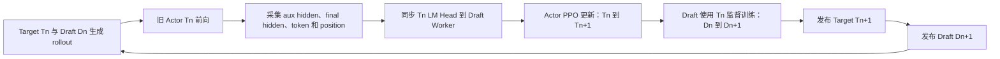
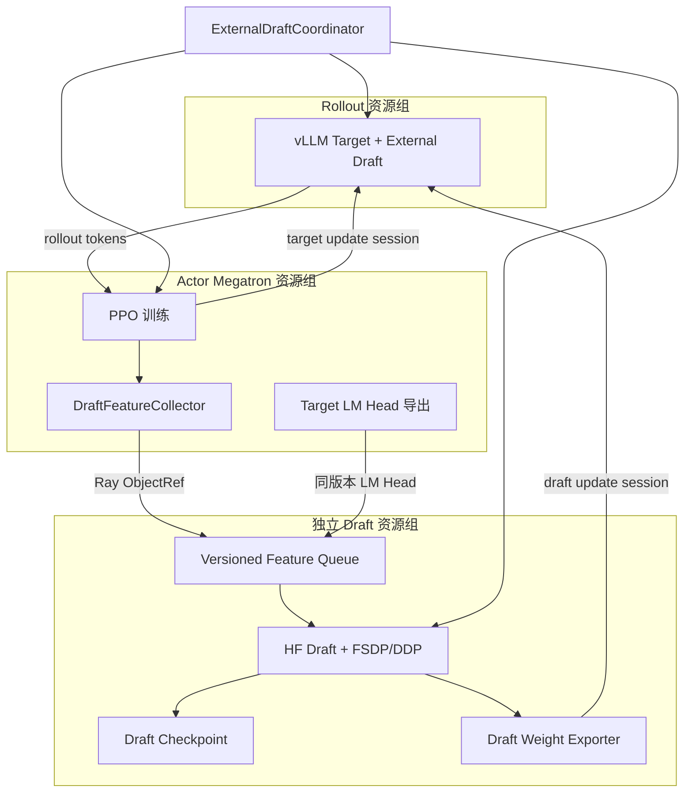

## 1. 背景

VIME 已经可以通过 vLLM 的 `SpeculativeConfig` 加载外部 EAGLE Draft 模型进行投机解码，但当前在线训练只覆盖 Target 模型内部的 MTP 层，外部 Draft 模型会随着 RL 过程中 Target 参数持续变化而逐渐失配。失配会降低 Draft token 接受率和平均接受长度，最终可能使投机解码的额外 Draft 与验证开销超过其收益。

本设计参考 verl-SpeCo 的实现，将目标模型在 RL 数据上的隐藏状态转化为 Draft 训练样本，在每轮或固定间隔的 Actor 更新期间训练独立 Draft 模型，并将新权重热更新到 vLLM 中的外部 Draft Model。

VIME 当前已经具备以下基础能力：

- vLLM 外部 EAGLE Draft 推理配置；
- Megatron Actor 的旧策略/current policy log-prob 前向；
- Ray 训练 Actor 与 placement group；
- Target 权重向 vLLM 的在线同步；
- `start_draft_weight_update` Draft 权重更新入口；
- rollout 暂停、cache flush、权重更新和恢复生成流程；
- Sample 中的投机接受率和接受长度数据结构。

需要新增的核心能力是：

1. 从 Megatron Target 前向中采集 Draft 训练特征；
2. 独立的外部 Draft 模型训练进程、优化器和 checkpoint；
3. Target 与 Draft 权重发布协调；
4. Target/Draft/Feature 的版本一致性管理；
5. 完整的 Draft 训练和投机解码观测指标。

## 2. 设计目标

### 2.1 功能目标

- 在 VIME RL 训练过程中在线训练外部 EAGLE3 Draft 模型；
- 从 Actor 的旧策略前向采集辅助层 hidden state 和 final hidden state；
- 保证 hidden state、冻结 Target LM Head 与监督分布来自同一 Target 版本；
- 周期性将 Draft 新权重热更新到所有 vLLM rollout engine；
- 支持 Draft 模型、优化器、scheduler 和版本状态保存与恢复；
- 提供 collect-only 特征落盘能力，为离线 Draft 训练和问题诊断预留接口；
- 投机解码继续保持 Target 分布精确，不改变 PPO 样本的目标分布。

### 2.2 性能目标

- 特征采集只选择部分样本和 token 窗口，不保存整批全序列 hidden state；
- 大特征张量不经过 Python driver，以 Ray ObjectRef 或等价的点对点通道传输；
- Draft 训练不阻塞 rollout 的时间应可配置和可观测；
- 生产版本在一次 rollout 暂停窗口内完成 Target 和 Draft 两类权重更新；
- 在线训练后的端到端 rollout tokens/s 应优于关闭投机解码的基线。

### 2.3 非目标

首期不包含以下内容：

- 不从头设计新的投机解码算法；
- 不将外部 Draft 模型改写成 Megatron 模型；
- 不支持有损 speculative acceptance；
- 不在首期支持 PP/CP 下的跨 stage 特征汇聚；
- 不在首期支持 Actor、rollout 与 Draft 三者复杂共卡；
- 不在首期实现 DFlash、DSpark、Domino 和 P-EAGLE；
- 不在首期实现完全异步的多版本 Draft 训练。

## 3. 参考实现分析

verl-SpeCo 通过三层扩展构成闭环：

- `SpecoTaskRunner` 替换上游 PPO Trainer，并为 rollout worker 注入 Draft 权重发布能力；
- `SpecoRayPPOTrainer` hook rollout、old-logprob、Actor 更新和 rollout 权重发布；
- 独立 `SpecoWorker` 接收 CPU/Ray ObjectRef 特征，周期性训练和发布 Draft。

参考文件：

- [TaskRunner 集成](../../../../verl-SpeCo/verl_speco/integration/task_runner.py)
- [PPO Trainer 集成](../../../../verl-SpeCo/verl_speco/trainer/speco_ray_trainer.py)
- [Draft Worker](../../../../verl-SpeCo/verl_speco/workers/speco_worker.py)
- [Draft Trainer](../../../../verl-SpeCo/verl_speco/trainer/base_trainer.py)
- [特征数据格式](../../../../verl-SpeCo/verl_speco/trainer/feature_store.py)

### 3.1 参考时序



该时序具有两个性质：

1. 一条 Draft 训练样本内部的 aux hidden、final hidden 和 LM Head 严格属于同一版本 `Tn`；
2. 下一轮服务组合是 `Target Tn+1 + Draft Dn+1`，Draft 相对新 Target 存在一轮有界滞后。

本设计首期保持这一行为。相比在 Actor 更新后额外执行一次 `Tn+1` 特征前向，它显著减少训练成本；同时通过版本字段和接受率指标显式监控滞后影响。

### 3.2 参考算法能力

| 算法 | 监督方式 | 本设计处理 |
|---|---|---|
| EAGLE3 | 多层 aux hidden；final hidden 经冻结 LM Head 生成软标签 | 首期实现 |
| EAGLE1/2 | hidden SmoothL1 回归与 token soft-CE | 后续 |
| DFlash | 多 anchor 并行 block 训练 | 第二阶段候选 |
| DSpark | DFlash、Markov bias 和 L1 分布匹配 | 后续 |
| Domino | DFlash 与 GRU 因果修正头 | 后续 |
| P-EAGLE | COD 下采样并行预测与 KL 训练 | 后续 |

### 3.3 不直接复制参考编排的原因

verl-SpeCo 的 Target/rollout 基于 verl worker 体系，Draft Trainer 使用 HF Transformers 与 FSDP。VIME 的 Actor 是 Megatron，数据采用 packed sequence，并存在 TP、PP、CP、VPP 等并行布局。因此：

- 可以移植 Draft model、loss、数据对齐规则和特征 schema；
- 不应直接移植 verl worker、dispatch、配置和进程组代码；
- Target hidden 采集必须针对 Megatron pipeline 和 packed sequence 单独实现；
- Target 到 vLLM 的权重转换继续使用 VIME 现有 Megatron-to-HF 路径；
- Draft 到 vLLM 的权重发布使用独立 HF Draft 参数迭代器。

## 4. VIME 现状与扩展点

### 4.1 训练主循环

当前 [train.py](../../../train.py) 的主时序为：

```text
rollout_manager.generate
    -> actor_model.async_train
    -> actor_model.save_model
    -> actor_model.update_weights
```

适合增加以下扩展点：

```text
rollout_manager.generate
    -> actor_model.async_train，并采集 Draft 特征
    -> draft_model.collect/train
    -> save Actor/Draft
    -> Target/Draft 联合发布
```

### 4.2 Actor 前向

[MegatronTrainRayActor](../../../vime/backends/megatron_utils/actor.py) 已通过 `compute_log_prob` 调用 `forward_only`。这是首期特征采集入口，因为：

- 该前向发生在 Actor 参数更新之前；
- 当前 Actor 权重通常与本轮 rollout Target 权重一致；
- 输入已经包含 PPO 训练所需完整 prompt/response token；
- 无需修改 vLLM 的生成响应协议以传回大规模 hidden state。

现有 `custom_megatron_before_log_prob_hook` 只能在前向前调用，无法取得每层输出、batch token 位置和 final hidden，因此需要在 `forward_only` 内增加结构化 collector，而不是仅依赖现有 hook。

### 4.3 vLLM Draft 权重更新

[VLLMEngine](../../../vime/backends/vllm_utils/vllm_engine.py) 已暴露：

- `start_weight_update`；
- `start_draft_weight_update`；
- `finish_weight_update`。

VIME 的 vLLM patch 会在 Draft 更新会话中将 weight transfer target 切换为外部 `DraftModelSpeculator` 中的 Draft 模型。当前 MTP 更新已经具备以下时序：

```text
pause generation
flush cache
start target update
send target weights
finish target update
start draft update
send draft weights
finish draft update
continue generation
```

外部 Draft 训练应复用该生命周期，但 Draft 权重必须由独立 Draft Worker 提供，不能像 MTP 路径一样再次发送 Actor 权重。

## 5. 总体架构



### 5.1 资源拓扑

新增 `draft` role：

```python
pgs = {
    "actor": ...,
    "critic": ...,
    "rollout": ...,
    "draft": ...,
}
```

首期建议 Draft 使用独立 GPU：

- 不加入 Actor 的 Megatron TP/PP/DP 进程组；
- Draft Worker 内部单独初始化 FSDP/DDP 进程组；
- 每个 Draft DP rank 接收不同样本；
- 只有全局 Draft leader 负责生成发布快照；
- Draft 训练完成后可将 model/optimizer offload 到 CPU，是否启用由配置控制。

独立资源组会增加 GPU 使用量，但可以显著降低以下首期风险：

- Megatron 与 FSDP 进程组冲突；
- Actor optimizer、Draft optimizer 与 rollout engine 的显存竞争；
- 共卡 sleep/wake 顺序导致的 NCCL 死锁；
- Draft 训练改变 Actor step 的性能统计。

## 6. 模块设计

### 6.1 `ExternalDraftCoordinator`

职责：

- 根据 rollout id 判断本轮是否采集、训练、保存和发布；
- 将 Actor 返回的特征 manifest 转交给 Draft 资源组；
- 在 Actor 更新前同步对应 Target LM Head；
- 驱动 Draft 训练并收集 metrics；
- 协调 Target/Draft 的 rollout 热更新；
- 维护 rollout id、Target version、Draft version 和已发布版本；
- 在异常情况下选择跳过 Draft 更新，而不是破坏 PPO 主流程。

建议接口：

```python
class ExternalDraftCoordinator:
    def should_collect(self, rollout_id: int) -> bool: ...
    def should_train(self, rollout_id: int) -> bool: ...
    def collect(self, rollout_id: int, manifests: list[FeatureManifest]) -> dict: ...
    def sync_target_head(self, rollout_id: int, head_ref: ObjectRef) -> dict: ...
    def train(self, rollout_id: int) -> DraftTrainResult: ...
    def save(self, rollout_id: int, force_sync: bool = False) -> None: ...
    def update_rollout_weights(self, actor_model, rollout_manager) -> dict: ...
```

### 6.2 `DraftFeatureCollector`

Collector 在 Actor `forward_only` 生命周期内工作：

1. 根据 rollout id、sample rate 和 token budget 生成采集计划；
2. 在配置的 Transformer 层安装 forward hook；
3. 在 LM Head/output layer 上安装 forward-pre-hook，取得 final norm 后的 hidden；
4. 运行现有 log-prob 前向；
5. 恢复 packed microbatch 到原始 sample 顺序；
6. 按采集窗口截取 token、hidden 和 position；
7. 异步复制到 CPU BF16 pinned memory；
8. 创建 Ray ObjectRef，只向上层返回 manifest；
9. 在 `finally` 中移除所有 hook，防止重复注册和引用泄漏。

采集计划必须是确定性的。建议使用以下字段计算 hash：

```text
seed = hash(global_seed, rollout_id, original_sample_id)
```

这样各 rank 可以独立得出相同窗口，不依赖 Python 进程随机状态。

### 6.3 final hidden 采集点

EAGLE3 `use_logits=false` 要求 final hidden 与 Target LM Head 输入严格一致。应捕获：

```text
Transformer layers
    -> final norm
    -> [capture here]
    -> LM Head
```

不能直接使用最后一个 Transformer layer 的原始输出代替，尤其对于 pre-norm 模型，否则冻结 LM Head 重建出的分布会与 Actor logits 不一致。

初始化时和定期运行时执行一致性检查：

```text
argmax(TargetLMHead(captured_final_hidden))
    == argmax(Actor logits)
```

同时记录最大 logit 误差或 top-k 一致率，超出阈值时拒绝该批特征。

### 6.4 Draft 训练 Actor

建议新增独立 `ExternalDraftRayActor`，而不是将逻辑塞入 `MegatronTrainRayActor`：

```python
class ExternalDraftRayActor:
    def init_model(self): ...
    def collect_features(self, manifests): ...
    def sync_target_lm_head(self, payload, target_version): ...
    def train_draft(self, rollout_id, target_version): ...
    def save_model(self, rollout_id, force_sync=False): ...
    def prepare_publish_snapshot(self, draft_version): ...
    def send_weights_to_rollout(self, update_session): ...
```

Draft 内部可以复用/移植 verl-SpeCo 的：

- EAGLE3 模型结构；
- vocab mapping；
- target embedding 加载；
- future-step 概率蒸馏 loss；
- token-mean 梯度归一化；
- Draft checkpoint 元数据。

需要替换的部分包括：

- OmegaConf/verl config 访问；
- verl dispatch 和 worker group；
- verl rollout TP/SP mesh；
- Actor LM Head 导出接口；
- SGLang hidden-state 布局；
- verl checkpoint manager hook。

### 6.5 Draft 权重发布器

Draft 发布器必须输出与 vLLM Draft checkpoint 相同的 HF 参数名和张量布局。

职责包括：

- 从 FSDP full/sharded state 中导出 publish state；
- 过滤 optimizer、冻结 Target LM Head 和非服务参数；
- 根据配置转换 BF16/FP16 发布 dtype；
- 按 bucket 发送，限制单次 Ray/NCCL payload；
- 计算参数名、shape、dtype 和 checksum；
- 调用 `start_draft_weight_update` 后发送 Draft 权重；
- 所有 engine 成功后才提交新的 Draft version。

如果任一 rollout engine 更新失败：

- 本轮 Draft version 不得标记为已发布；
- generation 保持暂停，直到 Target/Draft 状态恢复一致或明确回滚；
- 首期直接 fail-fast，不尝试静默使用部分更新的 engine 集群。

## 7. 数据契约

### 7.1 `DraftFeatureSample`

建议使用显式 schema version：

```python
@dataclass
class DraftFeatureSample:
    schema_version: int
    algorithm: str

    input_ids: torch.Tensor
    loss_mask: torch.Tensor
    position_ids: torch.Tensor
    hidden_positions: torch.Tensor

    aux_hidden_states: torch.Tensor
    final_hidden_states: torch.Tensor | None
    target_topk_logprobs: torch.Tensor | None

    rollout_id: int
    target_weight_version: str
    original_sample_id: str
    prompt_length: int
    response_length: int
    window_start: int
    window_end: int
    aux_layer_ids: list[int]
    hidden_layout: str
```

首期约束：

- `algorithm == "EAGLE3"`；
- `final_hidden_states` 必须存在；
- `target_topk_logprobs` 必须为空；
- `aux_hidden_states` 最后一维布局为按层拼接的 `[L * H]`；
- tensor 转 CPU 后必须 contiguous；
- hidden 使用 BF16，token/position 使用 int64，loss mask 使用 float32 或 bool；
- `window_end - window_start` 与 hidden row 数必须严格一致。

### 7.2 EAGLE3 对齐

假设 `h_aux[p]` 是位置 `p` 的辅助层 hidden，`h_final[p]` 是位置 `p` 输入 LM Head 的 final hidden，则首期训练样本对齐为：

```text
Draft feature:      h_aux[p]
Draft token input:  x[p+1]
Target distribution: LMHead_Tn(h_final[p+1])
Target token mask:  loss_mask[p+2]
```

因此一个有效训练窗口至少需要比 Draft feature row 多保留后续 token/final-hidden 行。窗口构造和裁剪不能在不理解 shift 的情况下分别处理各 tensor。

### 7.3 loss mask

- prompt token 不参与 Draft token loss；
- response 中的 padding、无效或截断占位 token 不参与 loss；
- 只有能够形成完整 future target 的位置参与 loss；
- 不允许因为窗口截断将 prompt 最后一个 token 错误计入 response loss；
- 多轮 agent 数据必须沿用 VIME 已有 `loss_masks`，不能仅按 prompt length 重建。

### 7.4 版本契约

每条特征必须携带：

```text
target_weight_version
rollout_id
lm_head_version
feature_schema_version
draft_architecture_fingerprint
```

首期训练规则：

```text
sample.target_weight_version == current_target_head_version
```

不满足时直接拒绝样本并记录 `draft/feature_rejected_version_mismatch`。

如果未来启用跨 step buffer，必须为每个 Target version 保存对应 LM Head snapshot，或切换到保存 target top-k logits 的监督模式。不能用当前 LM Head 处理旧版本 final hidden。

## 8. Megatron 并行处理

### 8.1 DP

- 每个 Actor DP rank 只采集本地样本；
- manifest 中保留原始全局 sample id；
- Draft DP rank 通过一致性 hash 或 round-robin 接收样本；
- 同一样本只归属一个 Draft DP owner，避免重复训练；
- loss 和 token count 在 Draft DP 组内做全局归约。

### 8.2 TP

Collector 必须识别 `sequence_parallel`：

- hidden 在 TP ranks 上复制时，仅 TP rank 0 导出；
- hidden 按 sequence 切分时，先在 TP 组 all-gather，再按 packed `cu_seqlens` 重建；
- hidden 按 hidden dimension 切分的模型，需要按正确维度 gather；
- gather 完成前不能创建 ObjectRef；
- 增加 shape 和 position 连续性断言，避免静默拼错。

### 8.3 PP/VPP

首期限定 `PP=1`、`VPP=1`。

后续支持 PP 时：

- 根据全局 layer id 找到所在 PP/VPP stage；
- 各 stage 只捕获本地目标层；
- 使用专用通信组或 Ray refs 汇聚同一样本的多个层；
- final hidden 由 pipeline last stage 导出；
- 只有全部目标层齐全的样本才能进入 Draft queue。

### 8.4 CP

首期限定 `CP=1`。

后续支持 CP 时，需要还原 CP 对序列首尾或分块切分后的原始 token 顺序，并同时恢复 position、loss mask、aux hidden 和 final hidden。仅 gather hidden 而不重建 mask/position 会造成难以发现的监督错位。

## 9. 在线训练时序

### 9.1 初始化

1. 解析并校验 Draft 配置；
2. 创建 rollout manager；
3. 创建 Actor/Critic；
4. 创建 Draft 资源组；
5. 加载 Draft model、optimizer、scheduler 和 checkpoint；
6. 校验 Draft checkpoint 与 vLLM speculative config；
7. 发布初始 Target 权重；
8. 必要时发布或校验初始 Draft 权重；
9. 比较 rollout engine 中的 Target/Draft checksum；
10. 开始 rollout。

### 9.2 每轮训练

| 阶段 | Target 版本 | Draft 版本 | 行为 |
|---|---:|---:|---|
| rollout | `Tn` | `Dn` | vLLM 生成样本 |
| feature capture | `Tn` | `Dn` | 旧 Actor 前向采集 `Tn` 特征 |
| head sync | `Tn` | `Dn` | 同步 `Tn` LM Head |
| Actor train | `Tn -> Tn+1` | `Dn` | PPO 更新 |
| Draft train | `Tn+1` | `Dn -> Dn+1` | 使用 `Tn` 监督训练 |
| publish | `Tn+1` | `Dn+1` | 依次更新 vLLM Target/Draft |

### 9.3 采集和训练周期

采集与训练分别控制：

```text
collect_interval_rollouts
train_interval_rollouts
publish_interval_rollouts
```

约束：

- 未采集到有效样本时不得触发 Draft optimizer step；
- Draft 未成功训练时不得发布空快照；
- Draft 训练成功但未到发布周期时可以继续保存在训练端；
- 下一次发布应发布最新完整 Draft 状态，而不是参数增量链；
- checkpoint 周期和发布周期可以不同。

## 10. 权重更新设计

### 10.1 首期实现

为了降低改造范围，首期允许：

```text
actor_model.update_weights()
draft_model.update_weights()
```

这可能造成两次 generation pause，仅用于验证正确性和端到端收益。

### 10.2 生产实现

将现有 Target updater 的生命周期拆成：

```python
session = rollout_manager.begin_weight_update(
    pause_generation=True,
    flush_cache=True,
)

actor_model.send_target_weights(session)
draft_model.send_draft_weights(session)

rollout_manager.commit_weight_update(session)
```

内部仍然使用两个 vLLM update session：

1. `start_weight_update` / `finish_weight_update`；
2. `start_draft_weight_update` / `finish_weight_update`。

但 generation 只暂停和恢复一次。

### 10.3 原子性

一次联合发布包含：

```text
target_version = N+1
draft_version = M+1
pair_id = hash(target_version, draft_version)
```

所有 engine 都成功后才提交 pair。任一 engine 失败时不得让路由层继续向部分更新的 engine 分发新请求。

首期采用 fail-fast；后续可增加：

- 从 CPU publish snapshot 重试；
- 将失败 engine 从 router 暂时摘除；
- 恢复上一组 Target/Draft pair；
- engine 重启后按版本重新同步。

## 11. 配置设计

建议新增参数：

| 参数 | 默认值 | 说明 |
|---|---:|---|
| `--enable-external-draft-training` | false | 启用外部 Draft 在线训练 |
| `--draft-algorithm` | eagle3 | Draft 算法 |
| `--draft-model-path` | null | Draft HF checkpoint |
| `--draft-model-factory-path` | null | 无 Transformers `auto_map` 时使用的 EAGLE3 模型 factory |
| `--draft-target-embedding-path` | `--hf-checkpoint` | 初始化 Draft embedding 的 Target checkpoint |
| `--draft-target-embedding-key` | `model.embed_tokens.weight` | Target embedding 参数名 |
| `--draft-num-nodes` | 1 | Draft 节点数 |
| `--draft-num-gpus-per-node` | 1 | 每节点 Draft GPU 数 |
| `--draft-feature-layer-ids` | null | Target 辅助层 id |
| `--draft-collect-interval` | 1 | 特征采集间隔 |
| `--draft-collection-sample-rate` | 1.0 | 样本采集率 |
| `--draft-max-samples-per-rollout-per-dp` | 16 | 每个 Actor DP 的样本预算 |
| `--draft-max-tokens-per-rollout-per-dp` | 16384 | 每个 Actor DP 的 token 预算 |
| `--draft-hidden-window-mode` | front | `front` 或 `random` |
| `--draft-hidden-window-tokens` | 512 | 单样本窗口长度 |
| `--draft-train-interval` | 1 | Draft 训练间隔 |
| `--draft-train-steps-per-trigger` | 10 | 单次触发 optimizer steps |
| `--draft-batch-size-per-gpu` | 4 | Draft batch size |
| `--draft-learning-rate` | 1e-5 | Draft learning rate |
| `--draft-lr-scheduler-type` | constant | `constant` 或 `cosine` |
| `--draft-lr-warmup-steps` | 0 | Draft scheduler warmup steps |
| `--draft-lr-total-steps` | 0 | cosine 总步数；0 表示从 rollout 计划推导 |
| `--draft-publish-interval` | 1 | Draft 发布间隔 |
| `--draft-publish-dtype` | bf16 | 发布 dtype |
| `--draft-checkpoint-path` | null | Draft checkpoint 目录 |
| `--draft-save-interval` | null | Draft 保存间隔 |
| `--draft-collect-only` | false | 只采集特征，不在线训练 |
| `--draft-feature-store-path` | null | 特征存储路径 |
| `--draft-offload-model` | false | 空闲时 offload Draft model |
| `--draft-offload-optimizer` | false | 空闲时 offload optimizer |

阶段 1 的最小启用示例（其余 Actor/rollout 参数沿用现有训练脚本）：

```bash
--enable-external-draft-training \
--draft-model-path /models/eagle3 \
--draft-model-factory-path your_package.eagle3.build_model \
--draft-num-nodes 1 \
--draft-num-gpus-per-node 1 \
--draft-feature-layer-ids 2,16,29 \
--draft-checkpoint-path /checkpoints/draft \
--draft-train-steps-per-trigger 10 \
--draft-batch-size-per-gpu 4 \
--update-weight-mode full \
--update-weight-transport nccl \
--vllm-speculative-config '{"method":"eagle3","model":"/models/eagle3","num_speculative_tokens":3}'
```

如果 Draft checkpoint 自带可训练的 Transformers `auto_map`，应省略
`--draft-model-factory-path`。Target embedding 默认从 `--hf-checkpoint` 的
`model.embed_tokens.weight` 加载；不同模型命名需要覆盖
`--draft-target-embedding-key`。

启动校验：

- `vllm_speculative_config.method == "eagle"`；
- speculative config 的 `model` 与 `draft-model-path` 架构一致；
- Draft `target_hidden_size` 与 Actor hidden size 一致；
- Draft 需要的 aux layer 数与 `draft-feature-layer-ids` 一致；
- Draft vocab mapping 覆盖所有 Draft vocab 行；
- `PP=1`、`CP=1` 首期约束成立；
- 未启用有损 acceptance method；
- checkpoint 中的 Draft architecture fingerprint 与当前配置一致。
